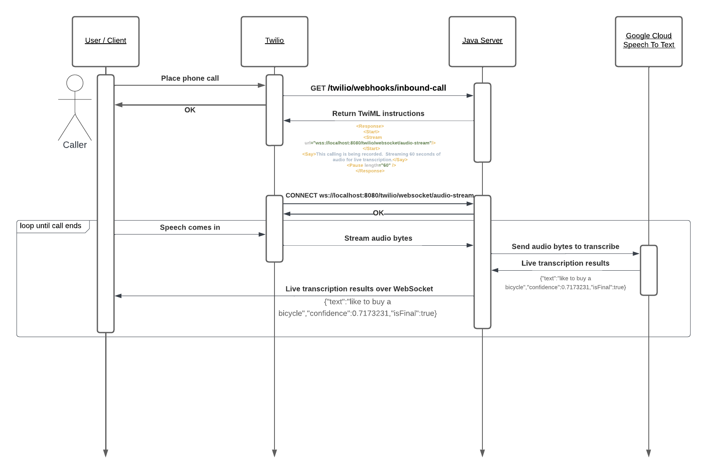
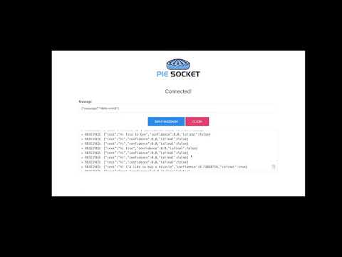

# Twilio Live Transcription Demo

## Introduction 

This repository runs a Java web server capable of handing incoming phone calls from Twilio and outputting live transcription results from Google Cloud Speech To Text in real time.  The server uses WebSockets to handle Twilio Media Streams and sending audio byte payloads to Google Cloud for transcription.  Once transcribed, the live results are published over another WebSocket connection for visualization and display.  

Please see this detailed written guide on how this works: https://www.sethmachine.io/2023/11/17/live-transcription-with-twilio-and-google/

To try the demo, you will need the following accounts or tools installed:

* [A Twilio account](https://www.twilio.com/try-twilio)
* [A Google Cloud account](https://cloud.google.com/free)
* [IntelliJ Java IDE or equivalent](https://www.jetbrains.com/idea/download/)
* [Maven](https://maven.apache.org/)
* [ngrok](https://ngrok.com/docs/getting-started/)
* [PieSocket WebSocket Tester](https://chrome.google.com/webstore/detail/piesocket-websocket-teste/oilioclnckkoijghdniegedkbocfpnip)

## Demo

The following video demonstrates speech over the telephone being immediately transcribed into text:

## How to use

Follow the guide here: https://www.sethmachine.io/2023/11/17/live-transcription-with-twilio-and-google/

1.  [Set up the Java web server](https://www.sethmachine.io/2023/11/17/live-transcription-with-twilio-and-google/#Setting-up-Java-web-server)
2. [Buy a Twilio phone number and configure it](https://www.sethmachine.io/2023/11/17/live-transcription-with-twilio-and-google/#Buy-and-configure-a-phone-number)
3. [Set up Google Cloud Speech to Text](https://www.sethmachine.io/2023/11/17/live-transcription-with-twilio-and-google/#Set-up-Google-Cloud-Speech-to-Text)
4. [Place a real phone call and observe output](https://www.sethmachine.io/2023/11/17/live-transcription-with-twilio-and-google/#Live-Transcription)
